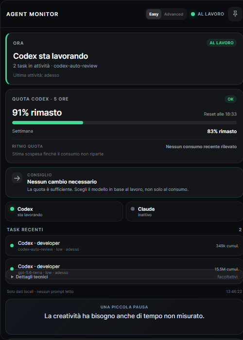

# Agents Monitor

[](https://github.com/Nardpoe/Agents-Monitor/actions/workflows/ci.yml)


A lightweight, local-first dashboard for monitoring Codex and Claude Code activity in near real time.



> Independent community project. Not affiliated with OpenAI or Anthropic.

## Why Agents Monitor?

When multiple coding agents are running, it can be difficult to understand how active they are, how quickly usage is changing, and which sessions were recently updated. Agents Monitor provides a compact local dashboard without sending your session data to an external service.

## Features

- Dedicated browser window
- Dark, semi-transparent interface
- Compact and expanded modes
- Optional always-on-top and right-side docking behavior on Windows
- Codex usage monitoring:
  - 5-hour and weekly quota when `rate_limits` data is available
  - burn rate
  - tokens per minute
  - recent sessions and detected agents
- Claude Code monitoring:
  - session tokens
  - tokens per minute
  - recent sessions
- Local file reading only
- No telemetry
- No external API required
- No prompt content displayed or stored

## Quick Start

### Requirements

- Windows
- Node.js 20 or newer
- Codex and/or Claude Code local session data

### Install

```bash
git clone https://github.com/Nardpoe/Agents-Monitor.git
cd Agents-Monitor
npm ci
```

### Run

```bash
npm start
```

Agents Monitor starts a server bound to `127.0.0.1` and automatically opens Edge or Chrome.

To start only the server:

```bash
npm run serve
```

Then open:

```text
http://127.0.0.1:4173
```

## Data Sources

Agents Monitor reads local JSONL session files:

| Source | Local path | What is used |
| --- | --- | --- |
| Codex | `~/.codex/sessions/**/*.jsonl` | Usage metadata, model metadata, rate limits when available, session structure |
| Claude Code | `~/.claude/projects/**/*.jsonl` | Usage metadata and session activity |

The application is designed not to display or store prompt text. Session records are parsed only to extract the metadata needed by the dashboard.

## Privacy

Agents Monitor is local-first:

- no telemetry
- no uploads
- no external analytics
- no external API required
- server listens only on `127.0.0.1`

This means the dashboard is not exposed to your local network by default.

## Default Color Thresholds

### Codex burn rate

- Green: below 1 percentage point per minute
- Yellow: from 1 to below 3 percentage points per minute
- Red: 3 or more percentage points per minute

### Remaining quota

- Green: above 35%
- Yellow: 16% to 35%
- Red: 0% to 15%

These are interface thresholds, not official OpenAI thresholds.

## Current Limitations

- Claude subscription quota is not estimated when it is unavailable in local logs.
- Codex sub-agent detection is heuristic because local session fields can vary between client versions.
- The initial parser reads at most the last 8 MB of each file, then continues incrementally to avoid loading very large histories into memory.
- The current desktop helper behavior is Windows-focused.

## Development

Install dependencies:

```bash
npm ci
```

Run tests:

```bash
npm test
```

Run syntax and consistency checks:

```bash
npm run check
```

CI runs these checks automatically on pushes and pull requests.

## Contributing

Contributions are welcome. Bug reports, feature ideas, documentation improvements, tests, and pull requests are all useful.

Please read [CONTRIBUTING.md](CONTRIBUTING.md) before opening a pull request.

## Security

Please read [SECURITY.md](SECURITY.md) before reporting a security or privacy issue.

## Changelog

See [CHANGELOG.md](CHANGELOG.md) for notable project changes.

## License

Distributed under the MIT License. See [LICENSE](LICENSE).
